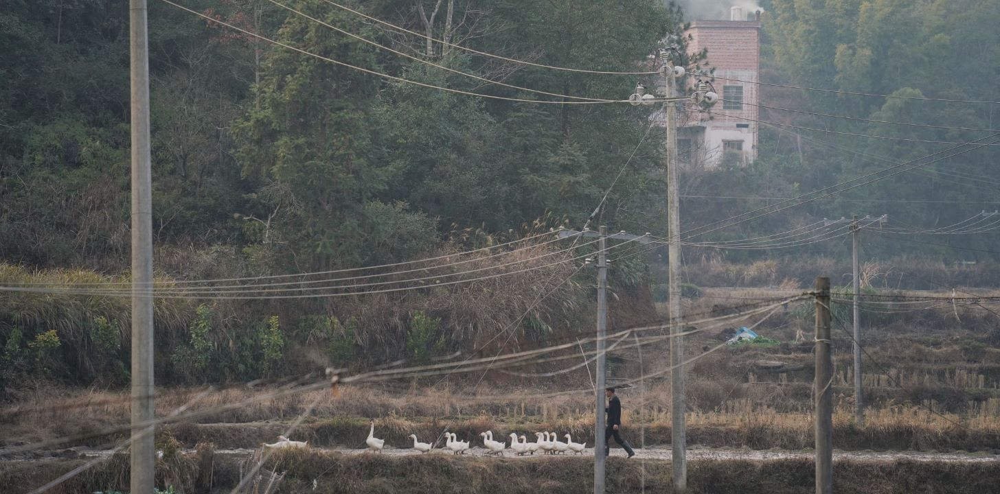

  

### Working Papers
1. Heterogeneity in Migration Costs, Aggregate Productivity, and Regional Income Inequality, *R&R*
2. Easing Fertility Restriction and Female Entrepreneurship: Theory and Evidence from China, with Xun Li (WHU) and Qianqian Wan (HKU), *under review*
3. Paper 3, *R&R*

### Selected Projects in Progress
1. Deglobalization and Analysts' Optimistic Bias: Evidence from the US-China Trade War, with Xun Li (WHU)

### Retired Projects
1. Revisiting the Impact of Foreign Direct Investment on Crime: A Global Analysis

